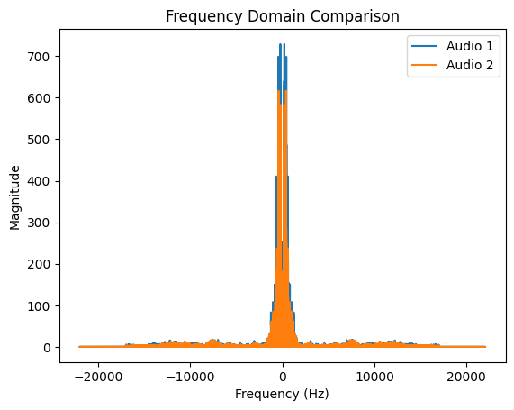

 # Audio Frequency Comparison and Voice Similarity Evaluation

## Objective
The objective of this project is to compare two audio recordings and measure
their similarity using frequency-domain features.

## Description
This project analyzes two audio signals by converting them from the time
domain to the frequency domain using Fast Fourier Transform (FFT).
Audio features such as frequency distribution and intensity are extracted
and compared to calculate a similarity score.

## Technologies Used
- Python
- NumPy
- Librosa
- Matplotlib
- SciPy

## Output
- A frequency-domain graph showing both audio signals
- A numerical similarity score indicating how similar the two audio files are.
## Frequency Comparison Graph

  

